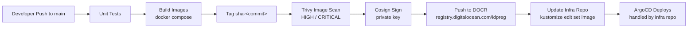

# Online Boutique:  Application Repository

This repository contains the **source code and CI/CD pipeline** for a production-grade, 11-microservice e-commerce platform. It is the **application half** of a two-repository GitOps architecture:

| Repository | Role |
|------------|------|
| **online-boutique-app** (this repo) | Application source code, container images, CI/CD pipeline |
| **online-boutique-doks-pf** | Infrastructure as Code (Terraform), GitOps (ArgoCD), Kubernetes platform |

The two repositories are deliberately separated: **application engineers/Developers work here; Devops/platform engineers work there.** The only bridge between them is a fully automated pipeline that builds, tests, scans, signs, and publishes container images, and then hands the release off to GitOps, after updating `kustomization.yaml`.

---

## Documentation

| Document | Contents |
|----------|----------|
| [Architecture](./architecture.md) | System design, pipeline flow, tech stack |
| [CI/CD Pipeline](./ci-cd-pipeline.md) | Every stage from commit to registry, step by step |
| [Security](./security.md) | Supply-chain security: scanning, signing, verification |
| [Services](./services.md) | The 11 microservices: languages, ports, dependencies |

---

## The Pipeline at a Glance



**CI ends at the registry.** Everything after deployment, verification, rollout is owned by the GitOps platform in the infrastructure repository. This is the core GitOps principle: *application code produces artifacts; the platform/GitOps decides how they run.*

---

## Key Design Decisions

| Decision | Rationale |
|----------|-----------|
| **Immutable SHA tags** (`sha-<commit>`) instead of `latest` | Every image is uniquely identifiable, reproducible, and auditable. `latest` is banned in production by policy (Kyverno `restrict-latest-tag`). |
| **Keypair-based Cosign signing** | The signing key lives in GitHub secrets; the public key lives in the Kyverno policy on the cluster. The cluster refuses unsigned or wrongly-signed images at admission time. |
| **Scan before sign, sign before push** | Nothing reaches the registry without passing Trivy (image) and the full PR security gate (Semgrep, TruffleHog, Trivy FS, Hadolint). |
| **Separate app / infra repos** | Least-privilege: application tokens cannot modify infrastructure. CI pushes images and updates image tags; ArgoCD reconciles the cluster. |

---

## Repository Structure

```
online-boutique-app/
├── src/                          # 11 microservice source trees (Go, C#, Node.js, Python, Java)
├── container-images/
│   └── docker-compose.yml        # Single build definition for all services (hardened)
├── .github/workflows/
│   ├── pr-checks.yml             # PR gate: unit tests + security scans
│   ├── security-essential.yml    # Reusable security workflow (Semgrep, TruffleHog, Trivy, Hadolint)
│   └── ci-main.yml               # Main pipeline: build → scan → sign → push → update infra
└── docs/                         # This documentation
```

---

## Quick Start (local build)

```bash
# Build all 11 service images
docker compose -f container-images/docker-compose.yml build

# Run the full stack (frontend on :80, :443 via Caddy)
docker compose -f container-images/docker-compose.yml up -d

# Optional: generate load (10 users, 1 req/s)
docker compose -f container-images/docker-compose.yml --profile load-test run loadgenerator
```
