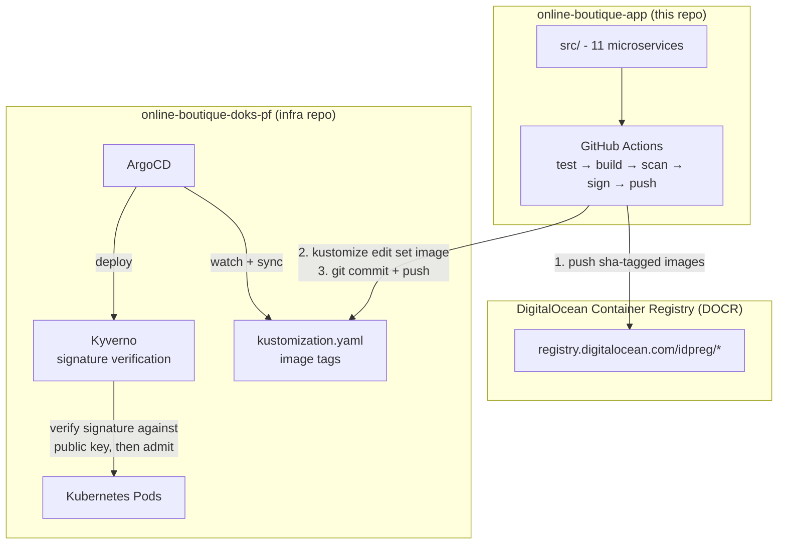
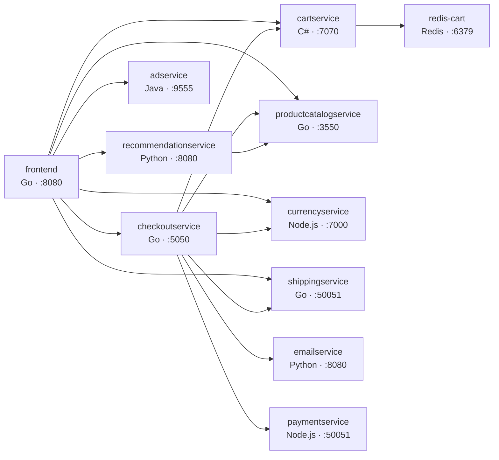

# Architecture Overview

The system is built on a **two-repository GitOps model**.

### Architecture Diagram

**The link between the two repositories is a single file:** `apps/boutique/kustomization.yaml` in the infra repo. Application CI writes the new image SHA there. ArgoCD detects the change and reconciles the cluster.

---

## The 11 Microservices

All internal communication is **gRPC**, except Redis (TCP) and the frontend (HTTP). Services resolve each other by DNS name inside the container network. No service discovery agent required.

---

## Container Networking (Docker Compose Build Definition)

The compose file defines the build environment and the local runtime:

- **`boutique-net`** bridge network: edge components (Caddy, frontend, load generator)
- **`backend-net`** `internal: true`: all backend microservices + Redis. No external egress.

Every service is hardened:

| Control | Applied |
|---------|---------|
| `no-new-privileges: true` | All services |
| `cap_drop: ALL` | All services |
| `cap_add: NET_BIND_SERVICE` | Services binding privileged ports |
| `read_only: true` + `tmpfs` | Caddy, frontend |
| Memory + CPU limits | All services (e.g. adservice 512M/1.0 CPU, cartservice 512M) |
| Health checks | Redis (redis-cli ping), Caddy (config endpoint) |

These same security properties carry over to the Kubernetes manifests in the infrastructure repo (non-root, read-only rootfs, all capabilities dropped).

---

## Technologies

| Layer | Technology |
|-------|-----------|
| Languages | Go, C#, Node.js, Python, Java (multi-language platform) |
| Communication | gRPC (protobuf), HTTP (frontend) |
| State | Redis 7 (cart) |
| Edge | Caddy 2 (local dev), nginx-ingress + cert-manager (production, in infra repo) |
| CI/CD | GitHub Actions |
| Image registry | DigitalOcean Container Registry (DOCR) |
| Security scanning | Trivy, Semgrep, TruffleHog, Hadolint |
| Signing | Cosign (keypair) |
| Deploy target | DOKS + ArgoCD (infra repo) |

---

## Why This Shape

1. **A single build definition** (`docker-compose.yml`) builds every service with the same tooling and tagging scheme. No per-service build drift.
2. **SHA-tagged immutable images** make every release reproducible: the tag embeds the exact commit.
3. **Scan-then-sign-then-push ordering** guarantees that anything signed has already passed the vulnerability gates. The signature attests to the artifact's content, not just its origin.
4. **The pipeline stops at the registry** deliberately. Deployment strategy, rollback, and policy enforcement belong to the platform layer, which operates on the same immutable artifacts.
