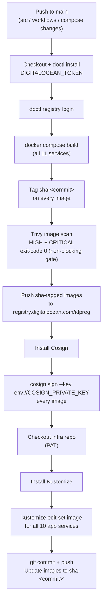

# CI/CD Pipeline

The pipeline lives in `.github/workflows/ci-main.yml`. It runs on every push to `main` and on demand via `workflow_dispatch`. The workflow ends once images are in the registry and the infra repo carries the new tag.



---

## Stage by Stage

### 1. Trigger

```yaml
on:
  push:
    branches: [ main ]
    paths:
      - 'src/*'
      - '.github/workflows/ci-main.yml'
      - 'container-images/docker-compose.yml'
  workflow_dispatch:
```

The pipeline runs only when something that affects the images changed: application source, the pipeline itself, or the build definition. Every run produces a fresh build. No caching of old artifacts.

### 2. Authenticate to the Registry

```bash
doctl registry login
```

Uses the `DIGITALOCEAN_TOKEN` GitHub secret (via `digitalocean/action-doctl`). No long-lived Docker credentials are stored. The token is injected per-run and scoped to the registry.

### 3. Build All Images

```bash
docker compose -f container-images/docker-compose.yml build
```

A **single build definition** (`container-images/docker-compose.yml`) builds all 11 microservices. Every service gets the same tooling, base images, and build context. No per-service build scripts to drift.

### 4. Tag with the Commit SHA

```bash
SHA_TAG=sha-${{ github.sha }}
docker tag <image>:latest <image>:$SHA_TAG
```

**Why not `latest`?** Immutable SHA tags mean:

- Every image is traceable to the exact commit that produced it
- Re-runs produce identical, reproducible artifacts
- Rollback is trivial: point the manifest at the previous SHA
- Production policy (Kyverno `restrict-latest-tag`) **blocks** `latest` anyway

### 5. Scan with Trivy

```bash
trivy image --severity HIGH,CRITICAL <image>:$SHA_TAG
```

Every image is scanned for vulnerabilities before it is signed or pushed. The scan runs with `--exit-code 0`; it records results without failing the build. The signature still certifies origin; the scan report is the evidence trail. The vulnerability database is downloaded once and reused across images with `--skip-db-update`.

### 6. Push to DOCR

```bash
docker push registry.digitalocean.com/idpreg/<service>:$SHA_TAG
```

Only SHA-tagged images are pushed. `latest` never leaves the runner.

### 7. Sign with Cosign

```bash
cosign sign --key env://COSIGN_PRIVATE_KEY <image>:$SHA_TAG
```

Every image is signed with the repository's Cosign **private key** (stored as the `COSIGN_PRIVATE_KEY` GitHub secret). The matching **public key** lives in the Kubernetes cluster inside the Kyverno `verify-image-signature` policy. The cluster itself becomes the verifier:

```
CI signs with private key ──► image + signature in DOCR
                                   │
Kyverno admission controller ◄─────┘
  "Is this image signed by our key?"
  yes ──► deploy
  no  ──► block
```

### 8. Update the Infra Repo (GitOps handoff)

```bash
git clone https://github.com/susu10-10/online-boutique-doks-pf  # with PAT
cd infra/apps/boutique
kustomize edit set image registry.digitalocean.com/idpreg/<service>:$SHA_TAG
git commit -m "Update images to sha-<commit>"
git push
```

For each of the 10 application services, the new SHA tag is written into `apps/boutique/kustomization.yaml` of the infrastructure repository. That single file is the **handoff point**. ArgoCD watches that repo, detects the change, and rolls the new images into the cluster.

```
┌─────────────┐   push   ┌──────────┐   sync   ┌─────────┐
│  App Repo   │ ───────► │ Infra    │ ───────► │ ArgoCD  │ ──► cluster
│  (this one) │   SHA    │ Repo     │          │         │
└─────────────┘   tags   └──────────┘          └─────────┘
```

---

## What CI Does NOT Do

- ❌ No SSH to servers
- ❌ No `kubectl` against the cluster
- ❌ No `latest` tags
- ❌ No secrets on the runner beyond the registry token and signing key

Deployment is the platform's job. This separation of concerns is what keeps the automation safe.

---

## Secrets Used

| Secret | Purpose | Scope |
|--------|---------|-------|
| `DIGITALOCEAN_TOKEN` | `doctl registry login` (push access) | Registry write |
| `COSIGN_PRIVATE_KEY` | Sign images (origin + integrity) | Signing |
| GitHub PAT (infra repo) | Push updated `kustomization.yaml` | Infra repo write |

Each secret is scoped to a single task.
