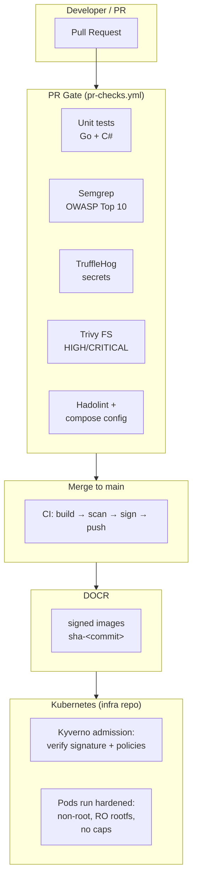

# Security

Security here is **defense in depth across the supply chain** from the PR to the pod that runs in production. Every layer assumes the layer before it could be compromised.



---

## Layer 1:  Pull Request Gate

Every PR to `main` runs **two jobs** in parallel (`pr-checks.yml`):

### Unit Tests

- Go tests for `shippingservice` and `productcatalogservice` (`go test`)
- C# tests for `cartservice` (`dotnet test`)
- Run on both `ubuntu-22.04` and `ubuntu-24.04` (matrix) catches OS-specific breakage

### Security Scans (reusable `security-essential.yml`)

| Tool | What it catches |
|------|-----------------|
| **Semgrep** (OWASP Top 10 rules) | Injection, XSS, path traversal, insecure deserialization in source |
| **TruffleHog** (`--only-verified`) | Real secrets committed to the repo — API keys, tokens, passwords |
| **Trivy filesystem scan** | Vulnerable dependencies across all 11 services (HIGH/CRITICAL) |
| **Hadolint** | Dockerfile anti-patterns: `latest` base images, missing pinning, `ADD` abuse |
| **docker compose config** | Validates the compose file is well-formed |

*Failed PR does not get merged to `main`.*

---

## Layer 2: Image Scanning (CI)

Trivy image scan on every build: `HIGH` and `CRITICAL` vulnerabilities are reported for every service image before signing. This is the artifact-level check and it inspects the actual container filesystem, not just the source tree.

---

## Layer 3: Signing (Origin + Integrity)

Every image is signed with **Cosign** using a **keypair**:

```
cosign generate-key-pair
  ├── cosign.key  (private) → GitHub secret COSIGN_PRIVATE_KEY
  └── cosign.pub  (public)  → Kyverno policy (infra repo)
```

The signature cryptographically binds three facts:

1. **Origin**: the image was produced by this repository's CI
2. **Integrity**: the image bytes have not been altered since signing
3. **Scan status**: signing happens *after* Trivy, so a valid signature implies that the image passed the vulnerability gate

**Why a keypair and not keyless?** Keyless signing relies on ephemeral OIDC tokens from the CI provider. DOCR does not natively integrate with GitHub OIDC for registry auth, so the pragmatic, provider-neutral choice is a dedicated signing keypair: private key in CI secrets, public key in the cluster policy. It is also fully self-contained, no external certificate transparency infrastructure is required to verify.

---

## Layer 4: Cluster-Side Verification (Kyverno)

The public key is embedded in the `verify-image-signature` ClusterPolicy. At **admission time** (before any pod starts), Kyverno:

1. Reads the image reference from the Deployment
2. Pulls the image + signature from DOCR
3. Verifies the signature against the embedded public key
4. **Allows** the pod only if verification succeeds

Combined with the `restrict-latest-tag` policy, the cluster enforces: *only signed, immutable, versioned images run here.*

---

## Layer 5: Hardened Containers

Every service image runs with the same hardening profile, defined in the build definition and mirrored in the Kubernetes manifests:

| Control | Effect |
|---------|--------|
| `runAsNonRoot: true` + `runAsUser: 1000` | No root processes |
| `readOnlyRootFilesystem: true` | No writes to the container filesystem |
| `allowPrivilegeEscalation: false` | No privilege escalation |
| `capabilities.drop: [ALL]` | No Linux capabilities |
| `fsGroup: 1000` | Volume ownership for non-root runtime |

The app repo defines these; Kyverno's *require-* policy family enforces them on the cluster, so even a developer who "forgets" gets the pod rejected or flagged, not silently shipped.

---

## Why This Order Matters

Sign **after** scanning, verify **before** running:

- If you sign first, a later scan could find a vulnerability in an already-trusted artifact
- If you don't verify at admission, an attacker with registry write access could swap an image and the cluster would run it

The chain `scan → sign → verify` makes each link depend on the previous one. That is the supply-chain security story end to end.
