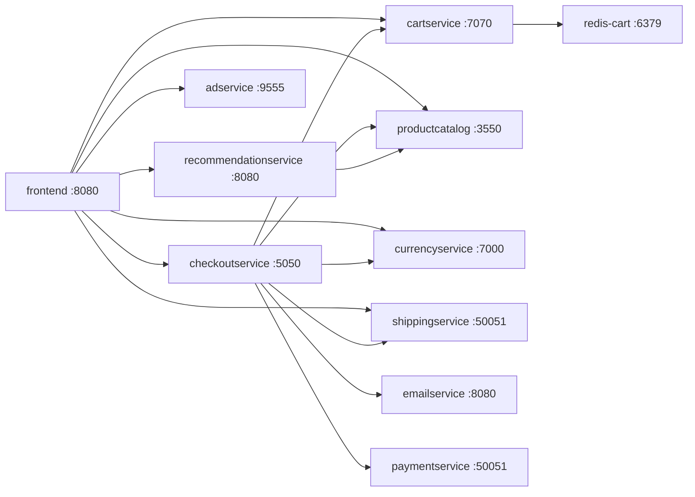

# Services

The platform runs **11 microservices** plus infrastructure companions, spanning 5 languages. All backend services communicate over **gRPC**; the frontend speaks HTTP.

| Service | Language | Port | Purpose | Depends on |
|---------|----------|------|---------|-----------|
| **frontend** | Go | 8080 | Web UI (server-rendered); the only HTTP-facing service | productcatalog, currency, cart, recommendation, checkout, ad, shipping |
| **cartservice** | C# | 7070 | Cart CRUD with Redis persistence | redis-cart |
| **productcatalogservice** | Go | 3550 | Product catalog (reads bundled `products.json`) | - |
| **currencyservice** | Node.js | 7000 | Currency conversion (fetches live ECB rates) | - |
| **checkoutservice** | Go | 5050 | Checkout orchestrator; calls every backend | productcatalog, shipping, payment, email, currency, cart |
| **shippingservice** | Go | 50051 | Shipping quote + order tracking (mock) | - |
| **paymentservice** | Node.js | 50051 | Payment processing (mock) | - |
| **emailservice** | Python | 8080 | Order confirmation emails (mock) | - |
| **recommendationservice** | Python | 8080 | Product recommendations | productcatalog |
| **adservice** | Java | 9555 | Ad serving (static mock) | - |
| **redis-cart** | Redis | 6379 | Cart state store | - |
| **loadgenerator** | Python | - | Locust load testing (manual, `load-test` profile) | frontend |

## Service Graph



## Networking

Defined in `container-images/docker-compose.yml`:

```
boutique-net   (bridge)       → edge: caddy, frontend, loadgenerator
backend-net    (internal:true)→ backend: all microservices + redis
```

The `internal: true` network means backend services have **no external egress** in local mode. The same isolation posture carries into Kubernetes via network policies.

## Hardening (applied to every service)

| Control | Detail |
|---------|--------|
| `no-new-privileges: true` | Blocks privilege escalation |
| `cap_drop: ALL` | Drops all Linux capabilities |
| `cap_add: NET_BIND_SERVICE` | Only capability re-added where ports < 1024 are bound |
| `read_only: true` + `tmpfs` | Immutable root filesystem (caddy, frontend) |
| Resource limits | Memory + CPU capped per service (128M–512M) |
| Health checks | Liveness/readiness for stateful services (redis, caddy) |

In Kubernetes (infra repo) the same posture is enforced at admission by Kyverno: `runAsNonRoot`, `readOnlyRootFilesystem`, `capabilities.drop: [ALL]`, `allowPrivilegeEscalation: false`.
